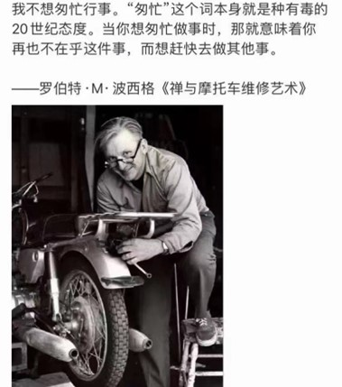
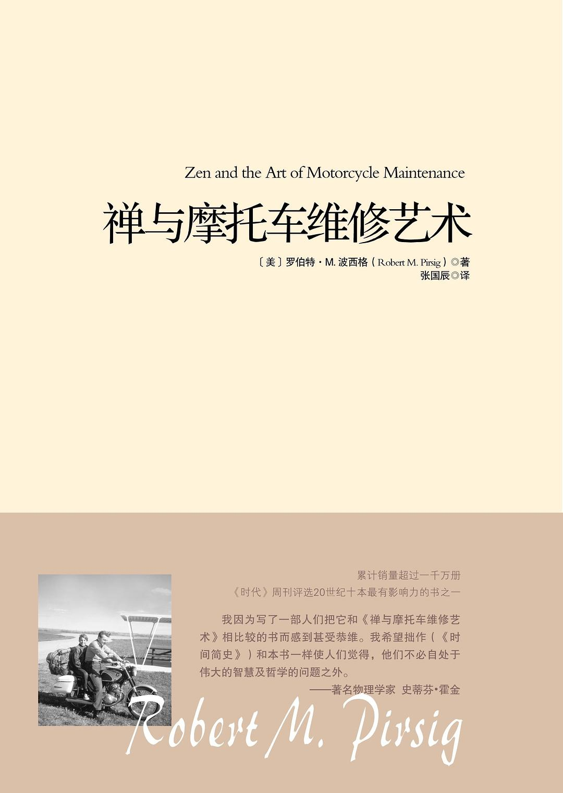
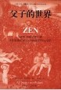
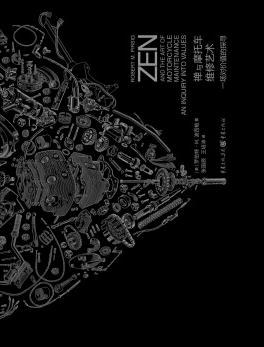

读一本书，总是需要一些机缘的。这本书的电子版在电脑里存了好多年，我一直没去点开它。前几年读完《乌克兰拖拉机简史》时，看到有书友的玩笑话：接下来好读《禅与摩托车维修艺术》啦。可是，我也没有动心去读。

去年偶然在一个公众号中看到这张图，引自书中的这句话打动了我。我把它截图保存，

> 图中是老的译文，新的译文稍稍有点儿不同：“在这次旅行当中，我想应该注意这一点，更深入地研究，进而了解二十世纪究竟是出了什么问题。我不想匆忙行事，因为匆忙本身就是一种要不得的二十世纪态度。当你做某件事的时候，一旦想要求快，就表示你再也不关心它，只想去做别的事。” （P38）

但也没去读这本书。紧接着，一天早晨上班路上，突然想起这句话，就在微信读书上找到，读了几页。巧的是，当天，就在当天下午，有位同学到办公室，送了这本书给我。真的好惊喜！在确认他并没有关注我当日的微信读书动态时，更加感慨这神奇的书缘。这是 2022 年 10 月 17 日，我把日期和“诗涛所赠”开心地写在了扉页上，but， 还是没有去读这本书。直到元旦前后，发现诗涛等几位同学组织了“小书虫”共读群，群里一月的共读书目里就有这本书。众缘具足，我终于开读啦！哈哈哈！前后花了将近一个月的时间，我囫囵吞枣地啃完这本 30 万字的著作，它成为我今年开读并读完的第一本书。

诗涛在群里分享过这本书的 2011 年重庆出版社的电子版，其实在这之前国内还有两个译本，一个是 1998 年中国友谊出版公司出版的《父子的世界》，再一个是重庆出版社 2006 年出版的，当时书名翻译为《万里任禅游》。我有幸得赠的是 2018 年重庆出版社的新版，翻译有很大改进，装帧非常漂亮，同时还附送了一本小册子，提供了关于作者和这本书出版过程的一些故事。

<table>
  <tr>
    <td>
 重庆出版社 2011 年
</td>
    <td>
 《万里任禅游》 2006 年
</td>
    <td>
 《父子的世界》 1998 年
</td>
  </tr>
</table>

作者罗伯特·M.波西格在 1967 年开始写作一篇关于摩托车维修的随笔，也就是《禅与摩托车维修艺术》的肇始。1968 年 6 月，他给 122 家出版商写信，说自己就精神与技术在生活中彼此割裂的问题正写一本书，是一本名字有点怪的书，想联系出版事宜。一个月后，他和儿子克里斯开始了一次摩托车之旅，这场旅行后来成为这本书的基本情节。波西格用了四年时间完成这本书。而所联系的众多出版社，只有威廉马洛公司一家认可这部书稿，在 1974 年将书出版。书一出版就获得了巨大成功，被《时代周刊》评选为 20 世纪 70 年代十本最有影响力的书之一，累计销售超过一千万册。

在接受记者采访时，波西格被问到：“你被 121 家出版商拒绝，是什么使你决心让这本书面世而没有退缩将书稿锁进书柜？波西格的回答是：“并没有那么艰难。那 122 封信是通过打字机一次性打印出来的。一开始，有 22 家出版商表示有兴趣，但是在写作的四年中，这个数字降到了 6。而这 6 家读过手稿后，只有一家愿意出版它。但是这正好，只需要一家就够了。”读到这里，不由赞叹波西格的智慧与豁达。

重庆出版社 2018 年

书中有两条线索交织在一起：一是父子两人（前半部分还有约翰夫妇同行）骑摩托车自东向西横穿美国大陆的旅程中见闻（书中以波西格父子 1968 年真实的旅行为叙述框架，增加了一些虚构的内容）；二是“我”对斐德洛的回忆。斐德洛是哲学系学生，同时也是大学《修辞学》教师，受困于西方哲学理论二元对立与二分法，努力地寻求解答，在探索良质（不是“良知”）的过程中陷入精神崩溃。《柏拉图对话集》中有个爱好哲学的雅典青年，也叫斐德洛。但这本书中的斐德洛与“我”（书中的父亲）其实是同一个人。“我”是在精神康复后，一边旅行一边梳理斐德洛的思想发展历程以寻求和解。

这本书体量比较大，而且有些部分比较艰涩，很容易被劝退。新版的封底上，上架建议为“外国文学”，但读者们往往更多把它归为哲学一类。确实，书中占篇幅最大的第三部分，在叙述父子旅途中艰难的登山过程时，更多追溯了斐德洛上至苏格打底，不断拷问、以探寻灵性高峰的漫长哲学思考过程，涉及很多形而上学的讨论。同时这本书也常被当作波西格的自传体作品，对照着他的人生经历来读，不胜唏嘘。

有一天，由于睡前琢磨着这本书，午觉时，梦中冒出五个字：“是一不是二”。好像是想用它去概括我所理解的斐德洛的核心结论。在书中，斐德洛不断地提出要消除主客体的二元对立观念。因为，无论在理论研究还是现实世界中，都充满各种各样的二元对立：灵与肉、科技与人文、古典与浪漫、精神与物质、理性与感性等等。斐德洛在这种对立中感受到疏离，甚至撕裂。而他最终提出的良质，被认为是主观和客观的共同源头，是科技与人文之间的关系，是所有宗教的原创力，是“道”……它具有不可言说性，但可以在生活中加以实践。比如，学会关心。真正关心自己、关心身边的人、关心周边的环境，关心手头的工作，当对立消除，彼此交融时，就能产生内心的平静，体会到良质。

这本书的出现，除了有作者个人经历的因素，也有当时美国社会状况的折射。战后，特别是 20 世纪 70 年代，面对科技与社会的迅猛发展，不少人感到无所适从，对科技或机械产生排斥或者恐慌。比如，一起骑行的约翰夫妇，一谈到摩托车修理及科技相关问题，就会变得焦躁不安。可是如果摩托车出现问题，就把它交给修理店了事，往往会把摩托车弄得更糟糕，除非碰上对摩托车修理具有热忱的师傅。但只要真正关心摩托车，是可以独立掌握摩托车维修艺术的。而“关心的另一面就是良质（P33）。”

波西格在书中举了一个爬山的例子。有一类“自我的爬山者”（斐德洛很警惕自我，倡导无我），就像一支失调的乐器，很难演奏出准确的音符。他的步伐和对环境的反应，不是太快就是太慢。要么步履匆匆，顾不上欣赏沿途的风光；要么步履蹒跚，在本该停下来休息的时候却选择继续前进。“他谈论的话题永远是别的事和别的地方。他的人虽然在此地，他的心却不在。因为他拒绝活在此地，他想赶快爬到山顶，但是即使爬上去了，他却仍然不会快乐，因为那时，山顶已经变成了‘此地’。（P248）”当心灵游离出此，而被彼所挂碍，就难以获得平静与安宁。读到此处，我获得了一种对当下的启示：收摄身心，过一种享受“此时此地此身”的生活，而这也是朱光潜先生的座右铭。

对这本书的解读，有着非常丰富的角度，蕴藏着多种可能性。它可以是一本哲学书，也可以是一部旅行随笔，还可以是一部个人成长的心路历程记录……斐德洛源源不断的思考使得书中金句频出。他一面进行哲学上的深奥讨论，一面也切合生活的实际，提出一些可操作的建议。比如，如何对治枯燥和无聊，如何修理摩托车哈哈哈。他以摩托车维修的角度切入对世界的观察，书中有不少关于摩托车的组件、功能以及维修方面的细节，颇有技师的气质。在豆瓣上，甚至有读者从软件开发的角度对这本书的赏析。文、史、哲、理和工，手艺人、创业者以及企业家大概都可以在书中获得一些启发。在旅行过程中，“我”一直在细心地观察儿子，一面体察父子之间有张力的关系，一面给予儿子默默的引导和支持。作为家长，还可以通过书中父子的交流，去思考亲子关系的磨合与彼此成就。此外，因为有着和斐德洛一样的职业身份，书中有关教学教育的内容，也推动我去反省自己过去的所思所行。斐德洛认为，“只有把学位和评分制度取消，你才能得到真正的教育。”（P225）他的实验性教改，能达到预期的效果吗？在现实中是否具有可行性？关于目标，斐德洛认为：“只为了未来的某个目标而生活是肤浅的，”（P238） 并且，引用克伦·威尔的话：“一个没有目标的人才能爬到最高。”（P245）可是，我们一直强调目标的树立对于人成长的重要性。那么，应如何智慧地看待目标？关于写作，斐德洛经过实验得出结论：“模仿是一种真正的罪恶。”（P225）可现实中，我们常常认为模仿是最基础的练习？……这是一本能引发我思考的书。

读到后来，我竟然生出来一些担心：如果我也像作者这样去思考去探寻，会不会也有落入精神分裂的风险。当然，按照书中的叙述，作者在旅途结束时，实现了对自我的救赎，最终与自己和解，与世界和解。虽然，他也说“试炼永远不会了结。人只要活着就会发生不愉快的事和不幸的事。”但“情况正在慢慢好起来。我们几乎可以这样期待。”（P485）总之，这段阅读旅程，很有收获，还带着点惊心动魄。这是一本我得着机缘还想重读的书。

这个月本来计划读《如何阅读一本书》，但读了几章之后，因为精力分配不过来，就暂停了。但巧的是，在《禅与摩托车维修艺术》里，出现了《如何阅读一本书》作者莫提默·艾德勒的身影。书中提到，20世纪30年代美国发生了针对实验性科学教育的反叛运动，艾德勒是领导者之一；基于心理学背景下的证据研究，结合西方经典著作的阅读，艾德勒认为，人类的智慧在近代进步得相当少……

最后，让我欣喜的是，在附送的小册子《生长的河》里，记录了“《禅与摩托车维修艺术》背后的书”，不是参考文献，只是说这些书影响了波西格观察和探究世界的方式。而书单的第一本，竟然是《希利尔讲世界史》，去年我在“荔枝”上一篇篇读录的书。我不禁想要跨时空与波西格握手，并默默地把他的第二部作品《莱拉：一场对道德的探寻》收入囊中。
