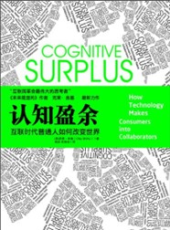
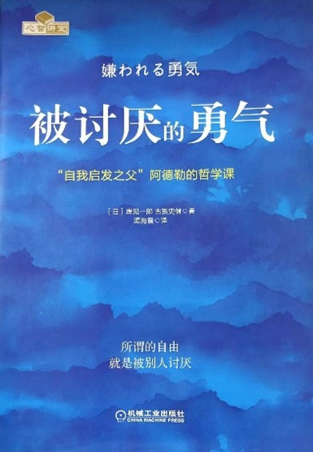
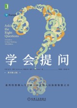
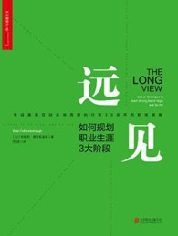

> 天初暖，日初长，好春光。万汇此时皆得意，竞芬芳。
>
> ——《春光好，天初暖》

转眼即三月，除夕的鞭炮声仍萦绕耳畔，十五的元宵亦历历在目，辞别父母，奔向远方，或奔波忙碌求职生活，或茫然无措面临选择……有些时候生活的剧本并没有如我们所愿，但依然要往前走，毕竟生活是自己的，也请留意旅途中的风景和暖意！

三月的书单关于底层构筑、人际关系、执行力等话题，希望我们不断沉淀下来，做到人事合一，纵身跃入生命之流，找寻独一无二的道路。

### 底层构筑

> 人们的自由时间除了仅仅用于内容消费，还应更多用于内容分享和创造。分享和创造的价值远大于消费。
> 
> ——克莱·舍基

ChatGPT 的火爆使我们悄然意识到人工智能时代正逐步走向我们日常生活。技术的进步正在一步步将人从机械的劳动中解放出来，个人拥有更多的盈余时间。但是面临一个信息过载的时代，你是否反思过，我们该如何参与这个世界？是完全沉浸于信息的海洋，溺水身亡？还是摒弃所有，以求内心平静？

克莱·舍基的《认知盈余——自由时间的力量》也许能够让我们重新思考参与这个世界的方式，如何支配属于自己的时间，创造和分享价值。

 

克莱•舍基说，美国人一年花在看电视上的时间大约 2000 亿个小时，而这几乎是 2000 个维基百科项目一年所需要的时间。如果我们将每个人的自由时间看成一个集合体，一种认知盈余，那么，这种盈余会有多大？我们已经忘记了我们的自由时间始终属于我们自己，我们可以凭自己的意愿来消费它们，创造它们和分享它们，我们可以通过积累将平庸变成卓越……

阅读该书可以思考几个问题，什么是认知盈余？如何保持认知盈余的可持续性？网络社区构建的四个方法？共享文化、去中心化协作方式对于商业模式、企业宣传、个人发展有哪些影响？

**参考资料**

- B站：[《认知盈余》 产生“认知盈余”的基本条件是什么？如何搭建网络共享社区？“共享文化”和“去中心化”带来哪些机会？互联网革命最伟大的思考者是谁？](https://www.bilibili.com/video/BV1hf4y1U7bV/?spm_id_from=333.337.search-card.all.click&vd_source=4342bb094f13a206a999742f8b3f88e7)
- 公众号：[马化腾亲自作序，力荐这本书《认知盈余》：自由时间的力量](https://mp.weixin.qq.com/s/MAFt0lBNMZ_jT8PamqAgRw)

### 心理

阿德勒心理学认为，发生什么事情并不重要，我们怎么看待这些事情才重要。生活会给我们各种束缚，表面上这些束缚似乎是关于时间、金钱、人际关系，但实际这些束缚都是来自于我们心灵的束缚。他试图将人从这种束缚里面解脱出来，让人重获心灵的自由。

 

本书用“青年与哲人的对话”这一故事形式总结了与弗洛伊德、荣格并称为“心理学三大巨头”的阿尔弗雷德·阿德勒的思想（阿德勒心理学）。

风靡欧美的阿德勒心理学对于“人如何能够获得幸福”这个哲学问题给出了极其简单而又具体的“答案”。了解了足以被称为“这个世界上的一个真理”的阿德勒思想之后，你的人生会发生什么变化呢？又或者，什么都不会改变？ 来吧，让我们与青年一起走进这扇“门”！

**参考资料**

- B站：[全网最细讲解《被讨厌的勇气》P1 阿德勒心理学教会我们什么？](https://www.bilibili.com/video/BV1FT411w76C/?spm_id_from=333.337.search-card.all.click&vd_source=4342bb094f13a206a999742f8b3f88e7)
- 公众号：[《被讨厌的勇气》解读](https://mp.weixin.qq.com/s/4FB7I0IEibuEzLd23ig9cw)

### 沟通表达

沟通是一种能力，提问是一门艺术，你的提问方式，有可能影响你的一生。

 

我们生活在嘈杂、喧嚣和不确定的世界里，每时每刻都被泛滥的信息所包围，大到世界经济发展趋势，小到个人生活的决策，面对别人和媒体都说的观点，如果你缺乏独立思考和判断，就只能全盘接受。即使专家说的再动听，也不一定靠谱。我们有必要依靠自己的大脑，不草率，不盲从，不为感性和无事实根据的传闻所左右，《学会提问》帮助我们有意识的学习和运用批判性思维，提出批判性问题，对问题深思熟虑，尽力理解那些价值观与我们背道而驰的人的分析推理方式，克服偏见对判断的影响，这样才有可能得出更为正确性的结论，世界在你眼中将变得更加有趣、开阔和坚定。

**参考资料**

- B站：[不当杠精，构建持续接近真理的独立思考能力：读·学会提问](https://www.bilibili.com/video/BV1F34y1h7ZX/?spm_id_from=333.337.search-card.all.click&vd_source=4342bb094f13a206a999742f8b3f88e7)

### 职场

毕业之后每每与朋友交流时，总会叹息在大学校园中对于自己未来的职业探索浅尝辄止。考公热、考研热、留学热，这些似乎都能帮我们更好地求职就业，但我们很少思考自己喜欢的方向、职业准备。

《远见》可以帮助尚未参加工作或者初入职场的我们找到热爱的工作，建立热爱的生活。

什么是成功的职业生涯？

成功的职业生涯不在于找到热爱的工作，而在于建立起你热爱的生活。

我们期盼梦想，但惧怕现实。我们认识的那个世界已经变了，而且变得很快。我们需要新的方法寻找工作，用新的方法建立可持续的职业生涯。

奥美互动全球首席执行官布赖恩•费瑟斯通豪在《远见》中，向我们展示了职业生涯中 3 个截然不同但相互关联的阶段，教会我们如何不断储备职场燃料以创造长期的成功。《远见》提供了实用的练习、工具和案例，带你重新思考和评估你的技能、时间和职场投资方向。远见思维帮助我们利用新方法寻找工作，平衡工作与生活，规划职业生涯的 45 年。

**参考资料**

- 公众号：[《远见》读书分享丨职业生涯中的一座灯塔](https://mp.weixin.qq.com/s/q57Q_WxY2RwPVZ79tZrLrw)

 

樱花将灿，雾尽风暖。趁着好春光，郊游踏青，品茗读书。

 

声明：以上图文内容来自豆瓣网。
